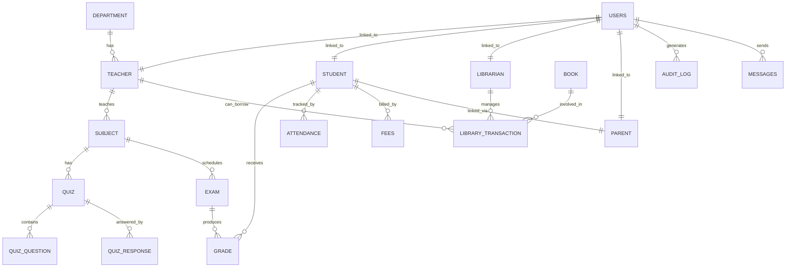

# `database.sql` — LMS Database SQL Reference

> **Location:** `server/sql/database.sql`  
> **Database:** Oracle (tested with Oracle 21c XE / Oracle Free)  
> **Executed by:** `seed.js` (full setup) and `apply_admin_pkg.js` (PL/SQL only)

---

## Overview

`database.sql` is the single authoritative SQL file for the Learning Management System (LMS). It consolidates all Oracle-specific DDL, constraint patches, PL/SQL packages, and stored procedures that the application depends on at runtime.

It is divided into **4 ordered sections**, each separated by a lone `/` line (Oracle SQL*Plus block terminator), which also allows Node.js scripts to split and execute blocks individually.

---

## File Structure

```
database.sql
├── SECTION 1 — Cleanup
├── SECTION 2 — DDL Patches  (2a through 2j)
├── SECTION 3 — PL/SQL Package: admin_user_pkg
└── SECTION 4 — Stored Procedure: GET_TEACHER_DASHBOARD_DATA
```

---

## SECTION 1 — Cleanup

**Purpose:** Clears stale data and drops legacy duplicate tables before re-seeding.

### What it does

1. **Drops plural-named legacy tables** — Legacy versions of tables used plural names (`MCQS`, `QUIZZES`, `BOOKS`, etc.). These are dropped with `CASCADE CONSTRAINTS` to avoid FK conflicts.

2. **Deletes all rows** from the canonical singular tables in **dependency order** (child tables first, parent tables last), so no FK violations occur.

### Why it's needed

`seed.js` needs a clean slate before inserting fresh seed data. Rather than `TRUNCATE` (which can't be rolled back easily with FKs), it uses `DELETE` + `COMMIT` wrapped in safe `EXCEPTION WHEN OTHERS THEN NULL` guards so missing tables are silently ignored.

### Tables cleared (in order)
```
MESSAGES → SCHOOL_EVENT → NOTIFICATIONS → QUIZ_RESPONSE → QUIZ_QUESTION →
QUIZ → GRADE → EXAM → STUDENT_SUBJECT → CLASS_SUBJECT → SUBJECT →
LIBRARY_TRANSACTION → BOOK → PARENT → FEES → ATTENDANCE → TIMETABLE →
STUDENT → TEACHER → LIBRARIAN → USERS → DEPARTMENT
```

---

## SECTION 2 — DDL Patches

**Purpose:** Idempotent `ALTER TABLE` and `CREATE TABLE` statements that extend the base schema.

Each patch is wrapped in a `DECLARE ... BEGIN ... END;` block that checks whether the column/constraint/table already exists before applying it, making them **safe to run multiple times**.

| Patch | Table | What it adds | Why it's needed |
|-------|-------|--------------|-----------------|
| **2a** | `QUIZ` | `class_name VARCHAR2(50)` | Filter quizzes by class in Teacher and Student portals |
| **2b** | `QUIZ` | `time_limit NUMBER` | Quiz countdown timer displayed in the UI |
| **2c** | `EXAM` | `term VARCHAR2(50)` | Group exams by academic term (Term 1, Term 2, etc.) |
| **2d** | `EXAM` | `class_name VARCHAR2(50)` | Filter exam schedule by class |
| **2e** | `LIBRARY_TRANSACTION` | `teacherid NUMBER` + FK | Allow teachers (not just students) to borrow books |
| **2f** | `ATTENDANCE` | Replace status `CHECK` constraint | Expand valid values to include `'Late'` and `'Leave'` (original only had `'Present'`/`'Absent'`) |
| **2g** | `USERS` | Replace role `CHECK` constraint | Add `'Student'` to the allowed roles list |
| **2h** | `AUDIT_LOG` | Create entire table | Admin activity tracking (who did what, when) |
| **2i** | `SCHOOL_EVENT` | Create entire table | School calendar events displayed on dashboards |
| **2j** | `MESSAGES` | Create entire table | In-app messaging between users |

---

## SECTION 3 — PL/SQL Package: `admin_user_pkg`

**Purpose:** Encapsulates all admin-level CRUD operations on the `USERS` table inside an Oracle PL/SQL package.

### Package structure

```sql
PACKAGE admin_user_pkg
  ├── PROCEDURE add_user(...)      -- INSERT a new user
  ├── PROCEDURE update_user(...)   -- UPDATE user fields by ID
  ├── PROCEDURE delete_user(...)   -- DELETE user by ID
  └── FUNCTION  get_all_users()    -- RETURN SYS_REFCURSOR of all users
```

### Procedures/Function details

#### `add_user`
- **Inputs:** `name`, `username`, `password`, `role`, `email`, `avatar_class`, `initials`
- **Output:** `p_out_msg` — `'User added successfully'` on success, `SQLERRM` on error
- **SQL:** `INSERT INTO USERS (...) VALUES (...)`
- Initializes `last_login` to `'-'`

#### `update_user`
- **Inputs:** `id` + all user fields
- **Output:** `p_out_msg`
- **SQL:** `UPDATE USERS SET ... WHERE id = p_id`
- Uses `COALESCE(p_password, password)` — **password is only updated if a new value is provided**

#### `delete_user`
- **Inputs:** `p_id`
- **Output:** `p_out_msg`
- **SQL:** `DELETE FROM USERS WHERE id = p_id`

#### `get_all_users` (function)
- **Returns:** `SYS_REFCURSOR` over `SELECT id, name, username, role, email, last_login, avatar_class, initials FROM USERS`
- Used by the admin panel's user management table

### How it's called in Node.js (`adminController.js`)
```js
// Example: calling add_user via oracledb
await connection.execute(
  `BEGIN admin_user_pkg.add_user(:name, :username, :password, :role, :email, :avatar_class, :initials, :out_msg); END;`,
  { name, username, password, role, email, avatar_class, initials, out_msg: { dir: oracledb.BIND_OUT, type: oracledb.STRING } }
);
```

### How to apply
```bash
node server/sql/apply_admin_pkg.js
```
> This runs Sections 3 & 4 only from `database.sql` (skips cleanup and DDL patches).

---

## SECTION 4 — Stored Procedure: `GET_TEACHER_DASHBOARD_DATA`

**Purpose:** Returns two result sets to the Teacher Portal dashboard in a single database call.

### Signature
```sql
PROCEDURE GET_TEACHER_DASHBOARD_DATA (
    p_students_cursor  OUT SYS_REFCURSOR,
    p_timetable_cursor OUT SYS_REFCURSOR
)
```

### Cursor 1 — Student Roster (`p_students_cursor`)

| Column | Source | Description |
|--------|--------|-------------|
| `id` | `STUDENT.studentid` | Student primary key |
| `name` | `STUDENT.fullname` | Student display name |
| `roll_no` | `STUDENT.admissionno` | Admission number |
| `grade` | `STUDENT.classname` | Class (e.g. `'7-A'`) |
| `status` | `STUDENT.status` | `'ACTIVE'` or `'INACTIVE'` |
| `attendance_rate` | Calculated | `ROUND(present+late / total * 100)`, defaults to `95` if no records |

**Attendance calculation:**
```sql
COALESCE(
  (SELECT ROUND(
      COUNT(CASE WHEN a.status IN ('Present', 'Late') THEN 1 END) * 100
      / NULLIF(COUNT(*), 0)
   ) FROM ATTENDANCE a WHERE a.student_id = s.studentid),
  95
) AS attendance_rate
```
- Counts both `'Present'` and `'Late'` as attended days
- `NULLIF(COUNT(*), 0)` prevents division-by-zero
- Falls back to `95` when no attendance records exist yet

### Cursor 2 — Timetable (`p_timetable_cursor`)

| Column | Description |
|--------|-------------|
| `day_of_week` | e.g. `'Monday'`, `'Tuesday'` |
| `time_slot` | e.g. `'8:30 AM - 9:15 AM'` |
| `class_name` | e.g. `'Grade 7-A'` |
| `subject` | e.g. `'Mathematics'` |
| `room` | e.g. `'Room 101'` |

### How it's called in Node.js (`teacherController.js`)
```js
const result = await connection.execute(
  `BEGIN GET_TEACHER_DASHBOARD_DATA(:students, :timetable); END;`,
  {
    students:  { dir: oracledb.BIND_OUT, type: oracledb.CURSOR },
    timetable: { dir: oracledb.BIND_OUT, type: oracledb.CURSOR }
  }
);
```

---

## How Scripts Use `database.sql`

### `seed.js` — Full database reset + seed

```
database.sql
  └── Section 1 (Cleanup)    ← executed first
  └── Section 2 (DDL Patches) ← executed second
  [seed data inserted here]
  └── Section 3 (Package)    ← executed last
  └── Section 4 (Procedure)  ← executed last
```

Run with:
```bash
node server/sql/seed.js
```

### `apply_admin_pkg.js` — PL/SQL only (no data reset)

```
database.sql
  └── Section 3 (Package)    ← executed
  └── Section 4 (Procedure)  ← executed
```

Use this when you only want to refresh the PL/SQL objects without wiping or re-seeding data:
```bash
node server/sql/apply_admin_pkg.js
```

---

## Remaining Files in `server/sql/`

| File | Purpose |
|------|---------|
| `database.sql` | ✅ All SQL definitions (this file) |
| `seed.js` | ✅ Full DB setup + seed data runner |
| `apply_admin_pkg.js` | ✅ PL/SQL-only runner (Sections 3 & 4) |
| `alter_attendance_constraint.js` | ✅ Standalone attendance constraint fixer (wraps Section 2f logic) |
| `create_audit_log.js` | ✅ Standalone AUDIT_LOG creator (wraps Section 2h logic) |
| `migrate_library.js` | ✅ Standalone library migration (wraps Section 2e logic) |

> **Note:** The standalone `.js` runners (`alter_attendance_constraint.js`, `create_audit_log.js`, `migrate_library.js`) exist for applying a single patch in isolation against a live database without running the full seed. Their SQL logic is now also captured in `database.sql` Section 2 as idempotent guards.

---

## Table Dependency Map


